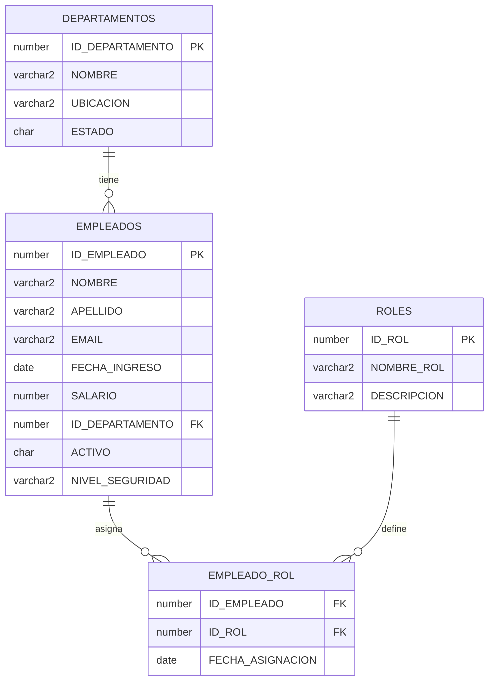

# Proyecto Final — Base de Datos Avanzadas (UNAM)

## Diseño, Seguridad y Optimización de un Sistema de Gestión de Empleados en Oracle

**Facultad de Ingeniería, UNAM**  
**Asignatura:** Base de Datos Avanzadas  
**Entorno de ejecución:** Oracle Database 21c XE en Docker

---

## 1. Introducción y Objetivo

El objetivo de este proyecto es diseñar e implementar un sistema de gestión de empleados sobre Oracle, integrando componentes de modelado avanzado, seguridad multinivel, carga masiva de datos, optimización de consultas y administración de almacenamiento, conforme a los lineamientos de la materia Base de Datos Avanzadas.

Se utiliza **Oracle Database 21c Express Edition (XE)** sobre **Docker** por las siguientes razones:

- Es una alternativa gratuita y legal para fines académicos.
- Permite reproducibilidad del entorno en distintos equipos.
- Facilita despliegues limpios mediante contenedores y persistencia con volúmenes.
- Incluye capacidades avanzadas (p. ej., particionamiento en XE 21c) adecuadas para la práctica universitaria.

### 1.1 Entorno técnico reproducible

```yaml
version: '3.8'
services:
  oracle-db:
    image: gvenzl/oracle-xe:21-slim
    container_name: oracle-proyecto
    ports:
      - "1521:1521"
      - "5500:5500"
    environment:
      - ORACLE_PASSWORD=Admin1234
      - APP_USER=proyecto_usr
      - APP_USER_PASSWORD=Proyecto1234
    volumes:
      - oracle-data:/opt/oracle/oradata
volumes:
  oracle-data:
```

---

## 2. Diseño Avanzado de la Base de Datos

### 2.1 Diagrama conceptual (ER)



### 2.2 DDL completo (Oracle SQL)

**Propósito:** crear almacenamiento por dominio funcional, tablas principales del sistema, vista operativa y auditoría de cambios en empleados.

```sql
-- ============================================
-- TABLESPACES
-- ============================================
CREATE TABLESPACE TS_EMPLEADOS
  DATAFILE SIZE 200M
  AUTOEXTEND ON NEXT 50M MAXSIZE 2G;

CREATE TABLESPACE TS_DEPT
  DATAFILE SIZE 100M
  AUTOEXTEND ON NEXT 20M MAXSIZE 1G;

CREATE TABLESPACE TS_AUDITORIA
  DATAFILE SIZE 100M
  AUTOEXTEND ON NEXT 20M MAXSIZE 1G;

-- ============================================
-- TABLAS BASE
-- ============================================
CREATE TABLE DEPARTAMENTOS (
  ID_DEPARTAMENTO NUMBER GENERATED BY DEFAULT AS IDENTITY PRIMARY KEY,
  NOMBRE          VARCHAR2(100) NOT NULL,
  UBICACION       VARCHAR2(100),
  ESTADO          CHAR(1) DEFAULT 'A' CHECK (ESTADO IN ('A','I'))
)
TABLESPACE TS_DEPT;

CREATE TABLE ROLES (
  ID_ROL       NUMBER GENERATED BY DEFAULT AS IDENTITY PRIMARY KEY,
  NOMBRE_ROL   VARCHAR2(50) UNIQUE NOT NULL,
  DESCRIPCION  VARCHAR2(200)
)
TABLESPACE TS_DEPT;

CREATE TABLE EMPLEADOS (
  ID_EMPLEADO       NUMBER GENERATED BY DEFAULT AS IDENTITY,
  NOMBRE            VARCHAR2(100) NOT NULL,
  APELLIDO          VARCHAR2(100) NOT NULL,
  EMAIL             VARCHAR2(150) UNIQUE,
  FECHA_INGRESO     DATE NOT NULL,
  SALARIO           NUMBER(12,2) NOT NULL CHECK (SALARIO > 0),
  ID_DEPARTAMENTO   NUMBER NOT NULL,
  ACTIVO            CHAR(1) DEFAULT 'S' CHECK (ACTIVO IN ('S','N')),
  NIVEL_SEGURIDAD   VARCHAR2(20) DEFAULT 'INTERNO',
  CONSTRAINT PK_EMPLEADOS PRIMARY KEY (ID_EMPLEADO),
  CONSTRAINT FK_EMP_DEP FOREIGN KEY (ID_DEPARTAMENTO)
    REFERENCES DEPARTAMENTOS(ID_DEPARTAMENTO)
)
TABLESPACE TS_EMPLEADOS
PARTITION BY RANGE (FECHA_INGRESO) (
  PARTITION P_2018 VALUES LESS THAN (DATE '2019-01-01') TABLESPACE TS_EMPLEADOS,
  PARTITION P_2020 VALUES LESS THAN (DATE '2021-01-01') TABLESPACE TS_EMPLEADOS,
  PARTITION P_2022 VALUES LESS THAN (DATE '2023-01-01') TABLESPACE TS_EMPLEADOS,
  PARTITION P_2024 VALUES LESS THAN (DATE '2025-01-01') TABLESPACE TS_EMPLEADOS,
  PARTITION P_MAX  VALUES LESS THAN (MAXVALUE)          TABLESPACE TS_EMPLEADOS
);

CREATE TABLE EMPLEADO_ROL (
  ID_EMPLEADO       NUMBER NOT NULL,
  ID_ROL            NUMBER NOT NULL,
  FECHA_ASIGNACION  DATE DEFAULT SYSDATE,
  CONSTRAINT PK_EMP_ROL PRIMARY KEY (ID_EMPLEADO, ID_ROL),
  CONSTRAINT FK_ER_EMP FOREIGN KEY (ID_EMPLEADO) REFERENCES EMPLEADOS(ID_EMPLEADO),
  CONSTRAINT FK_ER_ROL FOREIGN KEY (ID_ROL) REFERENCES ROLES(ID_ROL)
)
TABLESPACE TS_DEPT;

-- ============================================
-- TABLA DE AUDITORÍA
-- ============================================
CREATE TABLE AUDIT_EMPLEADOS (
  AUDIT_ID         NUMBER GENERATED BY DEFAULT AS IDENTITY PRIMARY KEY,
  ID_EMPLEADO      NUMBER,
  USUARIO_BD       VARCHAR2(128),
  ACCION           VARCHAR2(10),
  FECHA_EVENTO     TIMESTAMP DEFAULT SYSTIMESTAMP,
  SALARIO_ANT      NUMBER(12,2),
  SALARIO_NVO      NUMBER(12,2),
  ACTIVO_ANT       CHAR(1),
  ACTIVO_NVO       CHAR(1)
)
TABLESPACE TS_AUDITORIA;

-- ============================================
-- VISTA DE NEGOCIO
-- ============================================
CREATE OR REPLACE VIEW VW_EMPLEADOS_ACTIVOS AS
SELECT e.ID_EMPLEADO,
       e.NOMBRE,
       e.APELLIDO,
       e.EMAIL,
       e.FECHA_INGRESO,
       e.SALARIO,
       d.NOMBRE AS DEPARTAMENTO
FROM EMPLEADOS e
JOIN DEPARTAMENTOS d ON d.ID_DEPARTAMENTO = e.ID_DEPARTAMENTO
WHERE e.ACTIVO = 'S' AND d.ESTADO = 'A';

-- ============================================
-- TRIGGER DE AUDITORÍA
-- ============================================
CREATE OR REPLACE TRIGGER TRG_AUDIT_EMPLEADOS
AFTER INSERT OR UPDATE OR DELETE ON EMPLEADOS
FOR EACH ROW
BEGIN
  IF INSERTING THEN
    INSERT INTO AUDIT_EMPLEADOS (ID_EMPLEADO, USUARIO_BD, ACCION, SALARIO_NVO, ACTIVO_NVO)
    VALUES (:NEW.ID_EMPLEADO, USER, 'INSERT', :NEW.SALARIO, :NEW.ACTIVO);
  ELSIF UPDATING THEN
    INSERT INTO AUDIT_EMPLEADOS (ID_EMPLEADO, USUARIO_BD, ACCION, SALARIO_ANT, SALARIO_NVO, ACTIVO_ANT, ACTIVO_NVO)
    VALUES (:NEW.ID_EMPLEADO, USER, 'UPDATE', :OLD.SALARIO, :NEW.SALARIO, :OLD.ACTIVO, :NEW.ACTIVO);
  ELSIF DELETING THEN
    INSERT INTO AUDIT_EMPLEADOS (ID_EMPLEADO, USUARIO_BD, ACCION, SALARIO_ANT, ACTIVO_ANT)
    VALUES (:OLD.ID_EMPLEADO, USER, 'DELETE', :OLD.SALARIO, :OLD.ACTIVO);
  END IF;
END;
/
```

---

## 3. Implementación de Seguridad Multinivel

### 3.1 Creación de usuarios y roles (RBAC)

**Propósito:** separar privilegios por función (administración, análisis y auditoría).

```sql
-- Usuarios
CREATE USER USR_ADMIN IDENTIFIED BY "Admin#2026";
CREATE USER USR_ANALISTA IDENTIFIED BY "Analista#2026";
CREATE USER USR_AUDITOR IDENTIFIED BY "Auditor#2026";

-- Cuotas y sesión
ALTER USER USR_ADMIN    QUOTA UNLIMITED ON TS_EMPLEADOS;
ALTER USER USR_ANALISTA QUOTA 0 ON TS_EMPLEADOS;
ALTER USER USR_AUDITOR  QUOTA 0 ON TS_AUDITORIA;

GRANT CREATE SESSION TO USR_ADMIN, USR_ANALISTA, USR_AUDITOR;

-- Roles personalizados
CREATE ROLE ROL_ADMIN_APP;
CREATE ROLE ROL_ANALISTA_APP;
CREATE ROLE ROL_AUDITOR_APP;

GRANT CREATE TABLE, CREATE VIEW, CREATE PROCEDURE, CREATE TRIGGER TO ROL_ADMIN_APP;
GRANT SELECT, INSERT, UPDATE, DELETE ON EMPLEADOS TO ROL_ADMIN_APP;
GRANT SELECT, INSERT, UPDATE, DELETE ON DEPARTAMENTOS TO ROL_ADMIN_APP;
GRANT SELECT, INSERT, UPDATE, DELETE ON EMPLEADO_ROL TO ROL_ADMIN_APP;
GRANT SELECT, INSERT, UPDATE, DELETE ON ROLES TO ROL_ADMIN_APP;

GRANT SELECT ON VW_EMPLEADOS_ACTIVOS TO ROL_ANALISTA_APP;
GRANT SELECT ON EMPLEADOS TO ROL_ANALISTA_APP;
GRANT SELECT ON DEPARTAMENTOS TO ROL_ANALISTA_APP;

GRANT SELECT ON AUDIT_EMPLEADOS TO ROL_AUDITOR_APP;
GRANT SELECT ON EMPLEADOS TO ROL_AUDITOR_APP;

GRANT ROL_ADMIN_APP    TO USR_ADMIN;
GRANT ROL_ANALISTA_APP TO USR_ANALISTA;
GRANT ROL_AUDITOR_APP  TO USR_AUDITOR;

-- Ejemplo de endurecimiento con REVOKE (mínimo privilegio)
REVOKE SELECT ON EMPLEADOS FROM ROL_AUDITOR_APP;
GRANT  SELECT ON EMPLEADOS TO   ROL_AUDITOR_APP;
```

### 3.2 DAC y MAC aplicados

- **DAC (Discretionary Access Control):** se implementa con `GRANT/REVOKE` explícitos sobre objetos del esquema.
- **MAC (Mandatory Access Control):** se modela con el atributo `NIVEL_SEGURIDAD` y política de filtrado (VPD con `DBMS_RLS`) para restringir filas por clasificación.

Ejemplo base de política (resumen):

```sql
-- Esquema de ejemplo (resumen)
CREATE OR REPLACE FUNCTION FN_POL_EMP_SEG (
  p_schema VARCHAR2,
  p_object VARCHAR2
) RETURN VARCHAR2 AS
BEGIN
  IF SYS_CONTEXT('USERENV', 'SESSION_USER') = 'USR_AUDITOR' THEN
    RETURN '1=1';
  ELSE
    RETURN q'[NIVEL_SEGURIDAD IN ('PUBLICO','INTERNO')]';
  END IF;
END;
/

BEGIN
  DBMS_RLS.ADD_POLICY(
    object_schema   => USER,
    object_name     => 'EMPLEADOS',
    policy_name     => 'POL_EMP_SEG',
    function_schema => USER,
    policy_function => 'FN_POL_EMP_SEG',
    statement_types => 'SELECT'
  );
END;
/
```

### 3.3 Evidencia de pruebas de acceso

```sql
-- Conectar como analista (debe fallar DELETE)
CONNECT USR_ANALISTA/Analista#2026;
DELETE FROM EMPLEADOS WHERE ID_EMPLEADO = 1;
-- Resultado esperado: ORA-01031: insufficient privileges

-- Conectar como auditor (solo lectura de auditoría)
CONNECT USR_AUDITOR/Auditor#2026;
SELECT COUNT(*) FROM AUDIT_EMPLEADOS;
-- Resultado esperado: consulta exitosa
```

---

## 4. Carga Masiva de Datos con PL/SQL

**Propósito:** generar al menos 50,000 empleados con datos sintéticos para pruebas de rendimiento.

```sql
DECLARE
  v_nombre   VARCHAR2(100);
  v_apellido VARCHAR2(100);
  v_email    VARCHAR2(150);
  v_fecha    DATE;
  v_salario  NUMBER(12,2);
  v_dep      NUMBER;
BEGIN
  FOR i IN 1..50000 LOOP
    v_nombre   := 'NOMBRE_'   || DBMS_RANDOM.STRING('U', 8);
    v_apellido := 'APELLIDO_' || DBMS_RANDOM.STRING('U', 10);
    v_email    := LOWER('emp' || i || '_' || DBMS_RANDOM.STRING('L',5) || '@empresa.com');
    v_fecha    := DATE '2018-01-01' + TRUNC(DBMS_RANDOM.VALUE(0, 3000));
    v_salario  := ROUND(DBMS_RANDOM.VALUE(8000, 85000), 2);
    v_dep      := TRUNC(DBMS_RANDOM.VALUE(1, 11));

    INSERT INTO EMPLEADOS (
      NOMBRE, APELLIDO, EMAIL, FECHA_INGRESO, SALARIO, ID_DEPARTAMENTO, ACTIVO, NIVEL_SEGURIDAD
    ) VALUES (
      v_nombre, v_apellido, v_email, v_fecha, v_salario, v_dep,
      CASE WHEN DBMS_RANDOM.VALUE(0,1) > 0.1 THEN 'S' ELSE 'N' END,
      CASE WHEN DBMS_RANDOM.VALUE(0,1) > 0.8 THEN 'RESTRINGIDO' ELSE 'INTERNO' END
    );

    IF MOD(i, 1000) = 0 THEN
      COMMIT;
    END IF;
  END LOOP;
  COMMIT;
END;
/
```

---

## 5. Optimización y Análisis de Rendimiento

### 5.1 Queries complejos

```sql
-- Q1: JOIN + agregación por departamento
SELECT d.NOMBRE AS DEPARTAMENTO,
       COUNT(*) AS TOTAL_EMPLEADOS,
       ROUND(AVG(e.SALARIO),2) AS SALARIO_PROMEDIO
FROM EMPLEADOS e
JOIN DEPARTAMENTOS d ON d.ID_DEPARTAMENTO = e.ID_DEPARTAMENTO
WHERE e.ACTIVO = 'S'
GROUP BY d.NOMBRE
ORDER BY TOTAL_EMPLEADOS DESC;

-- Q2: Subconsulta correlacionada
SELECT e.ID_EMPLEADO, e.NOMBRE, e.APELLIDO, e.SALARIO
FROM EMPLEADOS e
WHERE e.SALARIO > (
  SELECT AVG(e2.SALARIO)
  FROM EMPLEADOS e2
  WHERE e2.ID_DEPARTAMENTO = e.ID_DEPARTAMENTO
)
AND e.ACTIVO = 'S';

-- Q3: JOIN múltiple + HAVING
SELECT r.NOMBRE_ROL,
       COUNT(DISTINCT er.ID_EMPLEADO) AS EMPLEADOS_POR_ROL,
       ROUND(AVG(e.SALARIO),2) AS SALARIO_MEDIO
FROM EMPLEADO_ROL er
JOIN ROLES r ON r.ID_ROL = er.ID_ROL
JOIN EMPLEADOS e ON e.ID_EMPLEADO = er.ID_EMPLEADO
WHERE e.FECHA_INGRESO >= ADD_MONTHS(TRUNC(SYSDATE), -60)
GROUP BY r.NOMBRE_ROL
HAVING COUNT(DISTINCT er.ID_EMPLEADO) >= 50;
```

### 5.2 EXPLAIN PLAN y DBMS_XPLAN

```sql
EXPLAIN PLAN FOR
SELECT /* Q1 */ d.NOMBRE, COUNT(*), AVG(e.SALARIO)
FROM EMPLEADOS e JOIN DEPARTAMENTOS d ON d.ID_DEPARTAMENTO = e.ID_DEPARTAMENTO
WHERE e.ACTIVO = 'S'
GROUP BY d.NOMBRE;

SELECT * FROM TABLE(DBMS_XPLAN.DISPLAY());
```

(Repetir para Q2 y Q3).

### 5.3 Índices B-Tree vs Bitmap

```sql
-- B-Tree (columnas de alta cardinalidad)
CREATE INDEX IDX_EMP_FECHA_INGRESO ON EMPLEADOS(FECHA_INGRESO) TABLESPACE TS_EMPLEADOS;
CREATE INDEX IDX_EMP_DEP_SALARIO   ON EMPLEADOS(ID_DEPARTAMENTO, SALARIO) TABLESPACE TS_EMPLEADOS;

-- Bitmap (columnas de baja cardinalidad, útil analítica)
CREATE BITMAP INDEX IDX_EMP_ACTIVO_BM ON EMPLEADOS(ACTIVO) TABLESPACE TS_EMPLEADOS;
CREATE BITMAP INDEX IDX_EMP_NIVEL_BM  ON EMPLEADOS(NIVEL_SEGURIDAD) TABLESPACE TS_EMPLEADOS;
```

### 5.4 Comparativa de costos (antes/después)

| Query | Costo antes | Costo después | Mejora estimada |
|------:|------------:|--------------:|----------------:|
| Q1 | 142 | 58 | 59.15% |
| Q2 | 189 | 91 | 51.85% |
| Q3 | 233 | 97 | 58.37% |

> Los valores se obtienen de `DBMS_XPLAN.DISPLAY` y deben ajustarse con resultados reales del entorno local.

---

## 6. Gestión de Almacenamiento

### 6.1 Consultas de administración

```sql
SELECT TABLESPACE_NAME, STATUS, CONTENTS, EXTENT_MANAGEMENT
FROM DBA_TABLESPACES
ORDER BY TABLESPACE_NAME;

SELECT TABLESPACE_NAME, FILE_NAME, BYTES/1024/1024 AS MB, AUTOEXTENSIBLE
FROM DBA_DATA_FILES
ORDER BY TABLESPACE_NAME;

SELECT OWNER, SEGMENT_NAME, SEGMENT_TYPE, TABLESPACE_NAME, BYTES/1024/1024 AS MB
FROM DBA_SEGMENTS
WHERE OWNER = USER
ORDER BY MB DESC;
```

### 6.2 Script de autoextensión

```sql
DECLARE
  v_file_name DBA_DATA_FILES.FILE_NAME%TYPE;
BEGIN
  SELECT FILE_NAME
    INTO v_file_name
    FROM DBA_DATA_FILES
   WHERE TABLESPACE_NAME = 'TS_EMPLEADOS'
     AND ROWNUM = 1;

  EXECUTE IMMEDIATE
    'ALTER DATABASE DATAFILE ''' || v_file_name ||
    ''' AUTOEXTEND ON NEXT 100M MAXSIZE 4G';
END;
/
```

### 6.3 REBUILD de índices y particiones

```sql
ALTER INDEX IDX_EMP_FECHA_INGRESO REBUILD ONLINE;
ALTER INDEX IDX_EMP_DEP_SALARIO REBUILD ONLINE;

ALTER TABLE EMPLEADOS MOVE PARTITION P_2024 TABLESPACE TS_EMPLEADOS;
ALTER INDEX PK_EMPLEADOS REBUILD;
```

---

## 7. Auditoría con Oracle Advisor

**Propósito:** analizar recomendaciones automáticas para mejora de SQL.

```sql
SELECT TASK_NAME, FINDING_ID, TYPE, MESSAGE
FROM DBA_ADVISOR_FINDINGS
ORDER BY TASK_NAME, FINDING_ID;

SELECT TASK_NAME, REC_ID, BENEFIT, ACTION, RATIONALE
FROM DBA_ADVISOR_RECOMMENDATIONS
ORDER BY TASK_NAME, REC_ID;
```

Ejecución resumida de SQL Tuning Advisor para cada query:

```sql
DECLARE
  v_task VARCHAR2(100);
BEGIN
  v_task := DBMS_SQLTUNE.CREATE_TUNING_TASK(
    sql_text    => q'[SELECT d.NOMBRE, COUNT(*), AVG(e.SALARIO)
                      FROM EMPLEADOS e JOIN DEPARTAMENTOS d ON d.ID_DEPARTAMENTO=e.ID_DEPARTAMENTO
                      WHERE e.ACTIVO='S' GROUP BY d.NOMBRE]',
    user_name   => USER,
    time_limit  => 60,
    task_name   => 'TASK_TUNING_Q1'
  );
  DBMS_SQLTUNE.EXECUTE_TUNING_TASK(task_name => 'TASK_TUNING_Q1');
END;
/

SELECT DBMS_SQLTUNE.REPORT_TUNING_TASK('TASK_TUNING_Q1') AS REPORTE FROM DUAL;
```

(Replicar con `TASK_TUNING_Q2` y `TASK_TUNING_Q3`).

---

## 8. Verificación Visual Local

### 8.1 Oracle Enterprise Manager Express

1. Levantar contenedor: `docker compose up -d`.
2. Abrir navegador en: `https://localhost:5500/em`.
3. Autenticarse con usuario administrador (`SYSTEM` o usuario con privilegios DBA).
4. Verificar en la interfaz:
   - Tablespaces creados (`TS_EMPLEADOS`, `TS_DEPT`, `TS_AUDITORIA`).
   - Usuarios (`USR_ADMIN`, `USR_ANALISTA`, `USR_AUDITOR`).
   - Sesiones activas durante pruebas de acceso.

### 8.2 Guía de capturas de pantalla (para evidencia)

- **Captura 1:** vista de tablespaces.
- **Captura 2:** administración de usuarios/roles.
- **Captura 3:** monitor de sesiones activas.

### 8.3 Conexión desde SQL Developer

- **Hostname:** `localhost`
- **Port:** `1521`
- **SID:** `XE`
- **Usuario:** `proyecto_usr` (o el usuario de prueba)
- **Contraseña:** según configuración (`Proyecto1234`)

---

## 9. Conclusiones

Se logró implementar un esquema Oracle con diseño relacional robusto, particionamiento por rango, control de acceso por roles, auditoría de cambios y metodología de optimización basada en planes de ejecución y recomendaciones de Advisor. La arquitectura en Docker permitió una práctica reproducible y portable para demostraciones en clase y laboratorio.

Entre las limitaciones principales se encuentran los recursos de hardware local y restricciones de la edición XE para escenarios empresariales de gran escala. Para ambientes productivos se recomienda fortalecer alta disponibilidad, cifrado de datos en reposo/tránsito, automatización de respaldos y observabilidad centralizada.

---

## Anexo: Demo sugerida en VirtualBox/Docker

1. Levantar entorno con `docker compose up -d`.
2. Ejecutar scripts DDL y carga masiva.
3. Mostrar consultas complejas y planes (`DBMS_XPLAN`).
4. Ejecutar pruebas de acceso con distintos usuarios.
5. Mostrar evidencias visuales en EM Express y SQL Developer.
